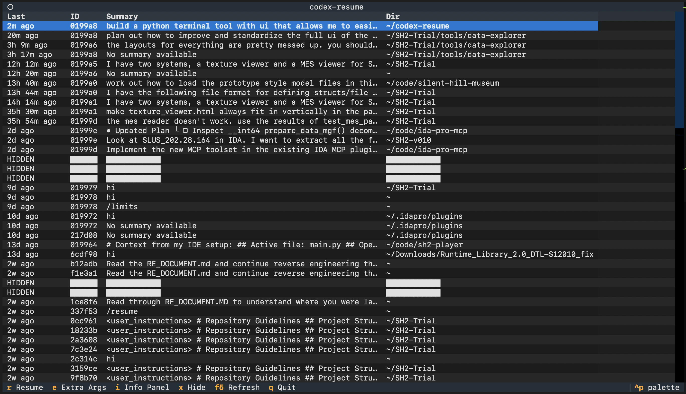
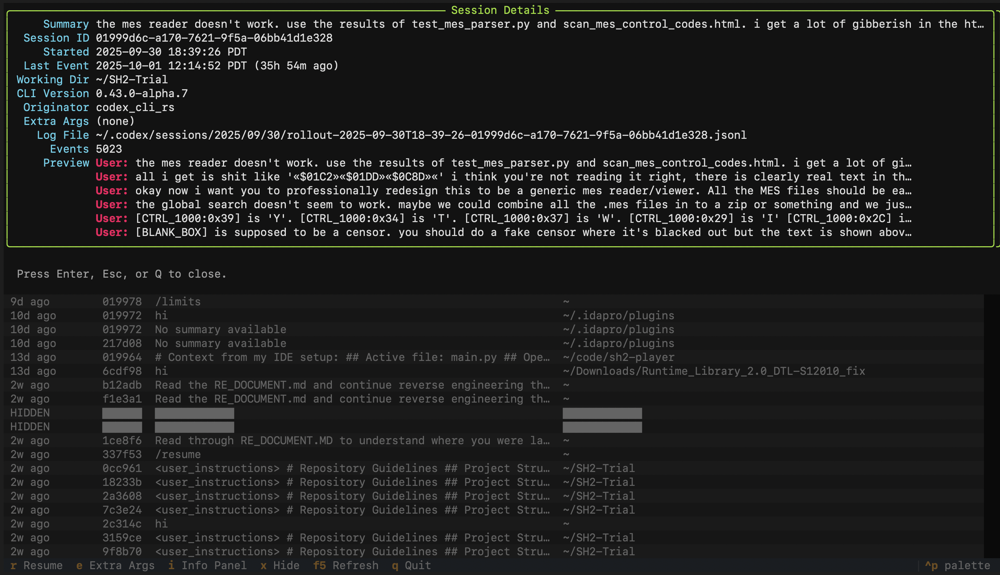

# codex-resume



`codex-resume` is a Textual-powered terminal UI built for resuming OpenAI Codex CLI sessions. It scans your `~/.codex/sessions` archive, surfaces metadata and chat previews, and relaunches any session with `codex resume <id>` in the original working directory.



> ⚠️ **WARNING WARNING VIBECODED GARBAGE ALERT** ⚠️
>
> was vibecoded. Install only if you do not fear slop.
>
> That said, this actually does work. It does the thing.

## Quick Start

```bash
uvx codex-resume
```

`uvx` will download the latest release, create an ephemeral environment, and launch the UI in one command. Use the arrow keys to pick a session, `E` to edit extra flags, and `Enter` to resume.

## Installation

### uv tool (recommended)

```bash
uv tool install codex-resume
```

Launch moving forward with:

```bash
codex-resume
```

### pip

```bash
pip install codex-resume
```

## Usage

## Usage

```bash
codex-resume [--extra "--search --yolo"] [--set-default-extra "--search --yolo"]
```

- Arrow keys to navigate
- `Enter` / `R` to resume
- `E` to edit extra args
- `I` for the info popup
- `X` to hide/unhide a row
- `F5` / `Ctrl+R` to refresh
- `Q` to quit
